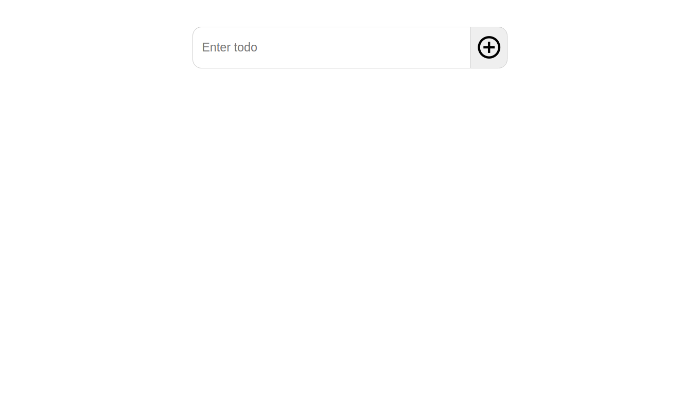
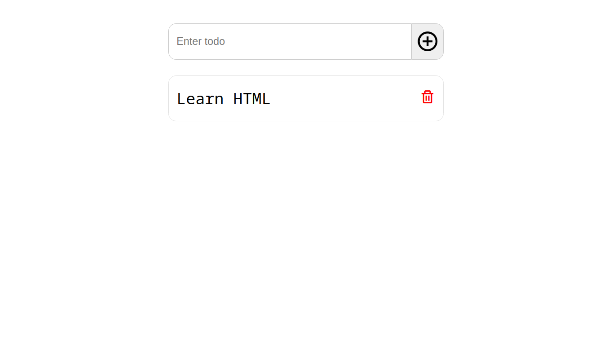
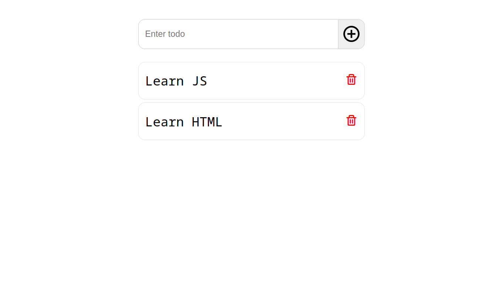
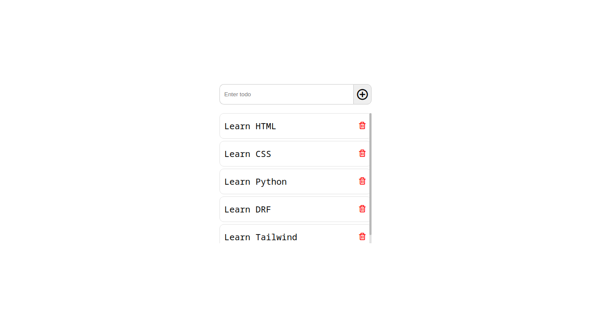

### Todo Приложение на Django
## Демо фотографий:





## Запуск
### Создание базы данных:
```
python3 manage.py migrate
```
### Запуск отладочного сервера:
```
python3 manage.py runserver
```
Теперь переходите в http://127.0.0.1:8000/ и смотрите результат.
### Развлекайтесь! ⚡️